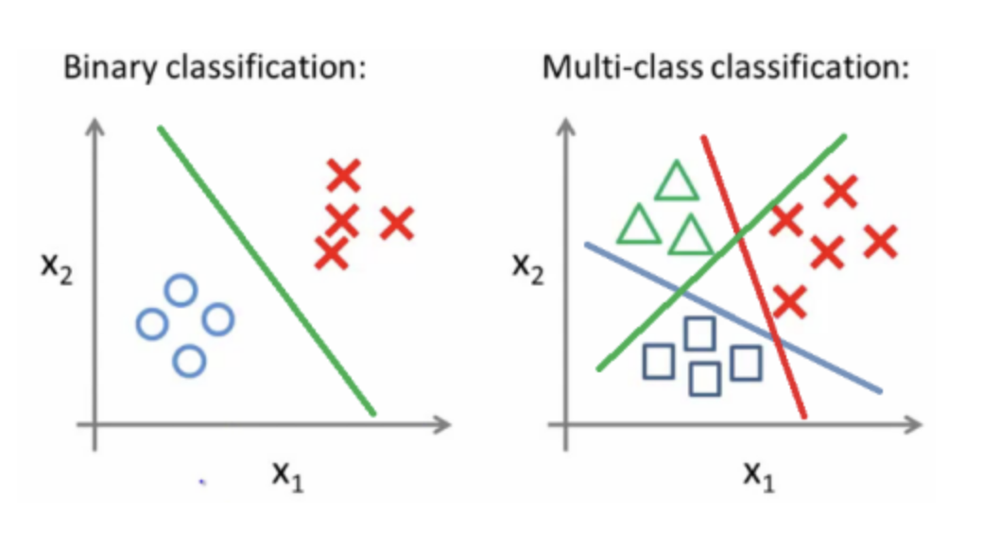
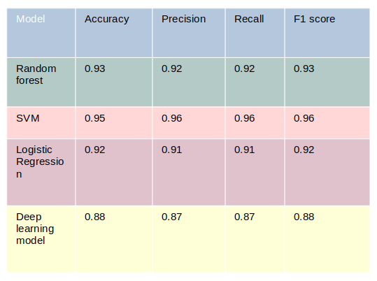

<!-- DON'T EDIT THIS SECTION, INSTEAD RE-RUN doctoc TO UPDATE -->
**Table of Contents**  *generated with [DocToc](https://github.com/thlorenz/doctoc)*

- [Text multiclass classification](#text-multiclass-classification)
  - [Dataset Preparation | Cleaning and Analysis](#dataset-preparation-cleaning-and-analysis)
  - [Feature Engineering | Transform text to number](#feature-engineering-transform-text-to-number)
  - [Model Training](#model-training)
 - [How the code works](#how-the-code-works)

# Text multiclass classification

Multi-class classification is the task of classifying elements into different classes. Unlike binary, it doesn’t restrict itself to any number of classes.  Here we are trying to detect job category, we have 12 job categories. This time we choosed instead of using the job description, we're going to try to predict it from only it's title. We did so because with the job description there is a lot a noise and our model will probably have more difficulties learning.

  

An end-to-end text classification pipeline is composed of three main components:

## Dataset preparation
We got 4 steps :   
  - Here there is no need for cleaning, since we are using job titles. The sentences are short and every information is important
  - Remove the NANs that are found on the csv file 
  - We've seen before that our data are imbalanced. To solve this issue we created a python function to crop data that are extra.
  - Labelize Data to prepare for training : from 0 to 15

## Features extraction
The best was to extract feature was to combine CountVectorizer with TfidfTransformer. more on feature engineering here : https://github.com/linainsaf/Binary_classification_job_location/blob/main/README.md

## Model Training
Here, as well we were able to acheive best results using SVM, we used the function GridSearch in order to find the best parameters.

the results that we got  : 

  

            
 Since SVM gave us the best results we used this model for our prediction.
  
# How the code works 

  We have 3 main folders and two txt files that contains the requirement (the models needed) to execute the code. In our Data folder we find the data needed to train our model. In the folder Models  we find all the trained models that we wanted to save. The Data folder isn't available for confidential reasons. 
  

In the folder app we find three function : 
- cleaning : take as input the main dataset and specification about what column we want to use as input data and what column to use as labels and returns input data cleaned with their labels. 
- algo: take as input the input data and then trains the model before saving it in Models.
-  main: in main we can make our predictions with a models of our choosing.

The code is flexible gives possibility to do ani text classification we wanted just by changing the input variables. 

If we want to train a new model, 
- We gather Data put them in the Data folder.
- Clean the Dataset using the function cleaning if needed.
- Train the model with the function algo : We modify our code to use the model wanted, here we gave an example for SVM but many other Models are available in scikit-learn library, we can train multiple models to compare them and use the best one. The trained models are going to be saved in Models automatically. 
- Make predictions using main function : Here we can use our trained model to make new predictions. 
 
If we want to use the model available,
- We give as input the data that we want to predict, the data must be text, a job title. We pass the data to the predict function inside the main, and we get the results.  

